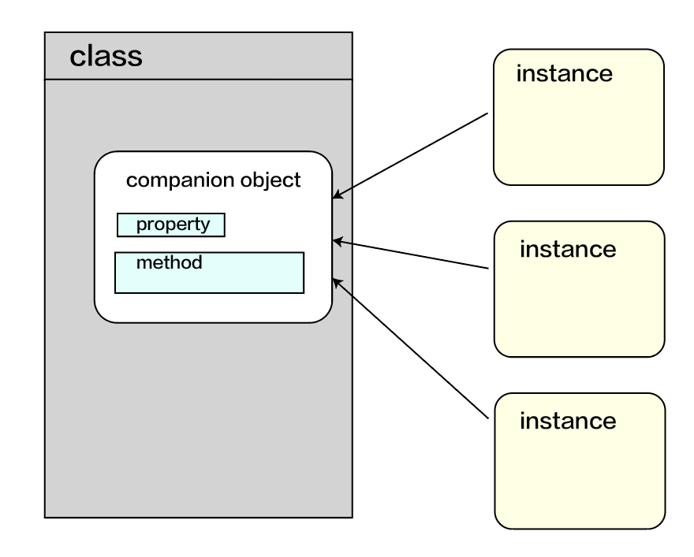

# companion object類別的陪同物件
~~~
相對於java,kotlin無法定義static property 和 static method, 但kotlin使用companion object來對應 
~~~

### 語法
	class ProductDetailsActivity {
	            companion object {
	            } 
	}

### android 實作
	//ProductDetailsActivity.kt
	        class ProductDetailsActivity : AppCompatActivity() {
	            override fun onCreate(savedInstanceState: Bundle?) {
	                super.onCreate(savedInstanceState)
	                val product = intent.getParcelableExtra<Product>
	                    (KEY_PRODUCT) // 3
	                //...
	            }
	            companion object {
	                const val KEY_PRODUCT = "product" // 1
	                fun start(context: Context, product: Product) { // 2
	                    val intent = Intent(context,
	                        ProductDetailsActivity::class.java)
	                    intent.putExtra(KEY_PRODUCT, product) // 3
	                    context.startActivity(intent)
	                 } 
	        }
	}
	        // Start activity
	        ProductDetailsActivity.start(context, productId) // 2
### companion object 實作       
	class Car{
	    init{
	        count++
	    }
	    companion object {
	        var count:Int = 0
	        private set
	    }
	}
	
	fun main(){
	    println(Car.count) // 0
	    Car()
	    Car()
	    println(Car.count) // 2
	}