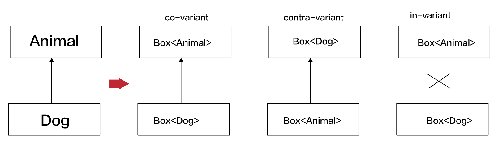

# Variance
~~~
繼承在物件導向程式是一種很一般的概念.
~~~
	open class Animal(val name:String)
	class Dog(name:String):Animal(name)

### 使用方法 class建立的type,因為子類別是可以變動的
	open class Animal(val name:String)
	class Dog(name:String):Animal(name)
	
	fun main(){
	    fun present(animal:Animal){
	        println("this is ${animal.name}")
	    }
	
	    present(Dog("Pluto"))
	}

### class 和 type 不一樣的地方
~~~
type可以被class或interface或內建的primitive建立, 一個class可以有2種type non-nullable(Dog)和 nullable(Dog?).
每一個generic class(class Box<T>),可以定義更多的data type(Box<Dog>,Box<Dog?>,Box<Animal>,Box<Box<Dog>>) 
~~~

### generic class建立的type是不可以變動的,代表不因為子類別關係而可以變動
~~~
這Box<Dog>type,不可以使用Box<子類別>，也不可以使用Box<父類別>
~~~
	class Box<T>
	open class Animal
	class Dog:Animal()
	
	fun main(){
	    var animalBox = Box<Animal>()
	    var dogBox = Box<Dog>()
	    //animalBox = dogBox //錯誤
	    //dogBox = animalBox //錯誤
	}

### 在kotlin,generic type可以有3種subtype的關系,co-variant,contra-variant,in-variant。可以使用variance modifiers

